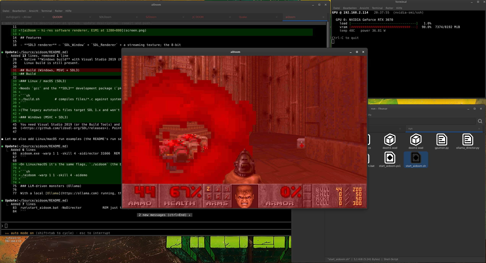

# aiDoom

A modernized fork of **SDL DOOM** (Sam Lantinga's 1998 SDL port of id Software's
1993 DOOM engine, *id Tech 1*), brought up to **64-bit, SDL3, and Windows-native**,
with a hi-res software renderer and an experimental **LLM "AI Director"** that lets
a language model drive monster tactics in real time.

> Originally `sdldoom-1.10-mod`. The engine is the original id source; almost all
> the new work lives in the platform layer (`files/i_*.c`) and a few self-contained
> modules.



## Features

- **SDL3 renderer** — `SDL_Window` + `SDL_Renderer` + a streaming texture; the 8-bit
  software framebuffer is palette-expanded to 32-bit and scaled with aspect-correct
  letterboxing (`SDL_SetRenderLogicalPresentation`).
- **Variable internal resolution** — the software renderer draws natively at
  320×200 … 1920×1200 (`hires` 1–6), switchable at runtime from an **Options → Video**
  menu (no upscaling of a fixed 320×200 image).
- **Mouse look**, toggle **autorun**, and an optional **`-friendlyfire`** flag that
  enables same-species monster infighting.
- **LLM AI Director** (`files/p_ai_llm.c`) — an external director drives monster
  *tactics* (flank, fall back, ambush, focus-fire, …) over a small TCP line protocol,
  or via a built-in scripted `-aidemo` director. A ready-to-run **Ollama** client is
  included (`ollama_director.py`). Off unless `-aidirector`/`-aidemo` is passed.
- Native **Windows build** with Visual Studio 2019 (MSVC) + SDL3; the legacy autotools
  Linux build is still present.

## Build

### Linux / macOS (SDL3)

Needs `gcc` and the **SDL3** development package (`pkg-config sdl3`). From the repo root:

```sh
./build.sh        # compiles files/*.c against system SDL3 and copies the binary into run/
```

(The legacy autotools files target SDL 1.x and won't link SDL3 — use `build.sh`.)

### Windows (MSVC + SDL3)

You need Visual Studio 2019 (or the Build Tools) and the **SDL3 SDK**
(<https://github.com/libsdl-org/SDL/releases>). Point the `SDL` variable at it.

From an *x86 Native Tools Command Prompt for VS 2019*, in `files\`:

```bat
nmake /f Makefile.msvc                 REM SDL = C:\Source\SDL3 by default
nmake /f Makefile.msvc SDL=C:\path\to\SDL3
```

This produces `aidoom.exe` and copies `SDL3.dll` next to it.

## Run

aiDoom needs a DOOM **IWAD** (`doom1.wad`, `doom.wad`, `doom2.wad`, …) in the working
directory — **bring your own**; IWADs are copyrighted id Software data and are not
distributed here. The shareware `doom1.wad` is freely available.

```bat
aidoom.exe -warp 1 1 -skill 4
aidoom.exe -warp 1 1 -skill 4 -aidemo            REM built-in scripted director
aidoom.exe -warp 1 1 -skill 4 -aidirector 31666  REM open the TCP director server
```

On Linux/macOS it's the same flags, `./aidoom` (the binary `build.sh` puts in `run/`):

```sh
./aidoom -warp 1 1 -skill 4 -aidemo
```

### LLM-driven monsters (Ollama)

With a local [Ollama](https://ollama.com) running, the `run\start_aidoom.bat` launcher
waits for Ollama, then starts the game with the AI director and connects the client:

```bat
run\start_aidoom.bat                       REM default model mistral:7b-instruct
run\start_aidoom.bat -Skill 4 -FriendlyFire
run\start_aidoom.bat -NoDirector           REM just the game
```

On Linux/macOS use `run/start_aidoom.sh` (same idea — waits for Ollama, then starts
game + director; see `run/README.md`):

```sh
run/start_aidoom.sh --skill 4 --friendlyfire
```

The director protocol (`observe` / `act` / `wake`) and design rationale are documented
in **AGENT_CONTROL.md** §12–13 and **MONSTER_AGENT_GUIDE.md**.

## Documentation

- `AGENT_CONTROL.md` — full player- and monster-control API & TCP protocol
- `MONSTER_AGENT_GUIDE.md` — guide to directing monsters with an LLM
- `CLAUDE.md` — architecture notes & build/porting gotchas

## License

The DOOM engine source is governed by the **DOOM Source Code License** (`DOOMLIC.TXT`)
— free to distribute and modify, **not for commercial use**. The SDL port additions are
by Sam Lantinga. See `LICENSE.TXT`.

## Credits

- id Software — original DOOM source
- Sam Lantinga — the SDL port
- This fork — 64-bit / SDL3 / Windows port, hi-res renderer, and the LLM AI Director
