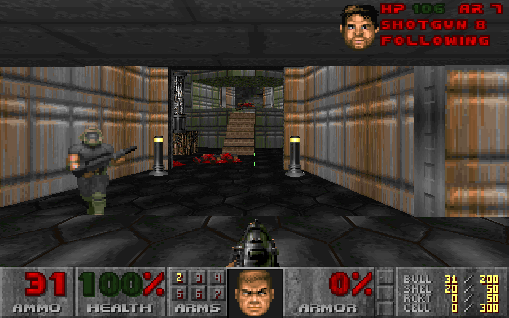
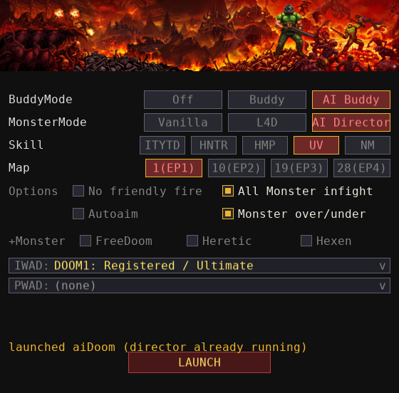
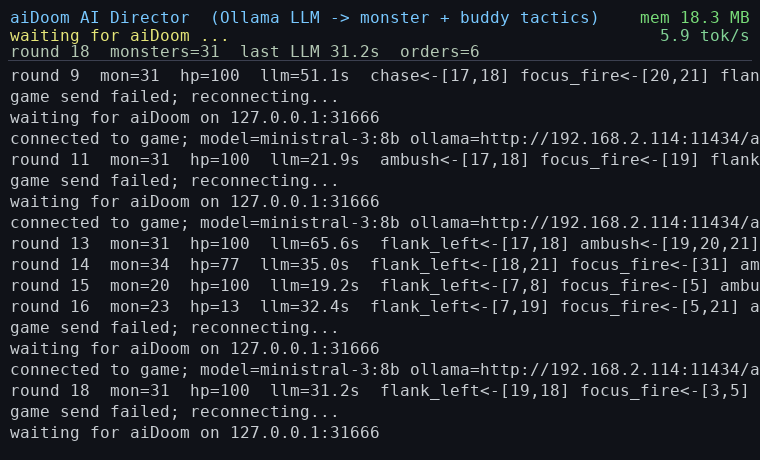
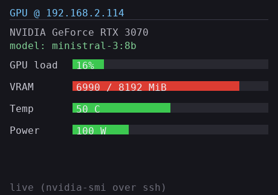

# aiDoom

A modernized fork of **SDL DOOM** (Sam Lantinga's 1998 SDL port of id Software's
1993 DOOM engine, *id Tech 1*), brought up to **64-bit, SDL3, and Windows-native**,
with a hi-res software renderer and an experimental **LLM "AI Director"** that lets
a language model drive monster tactics in real time.

> Originally `sdldoom-1.10-mod`. The engine is the original id source; almost all
> the new work lives in the platform layer (`files/i_*.c`) and a few self-contained
> modules.



## Features

- **SDL3 renderer** — `SDL_Window` + `SDL_Renderer` + a streaming texture; the 8-bit
  software framebuffer is palette-expanded to 32-bit and scaled with aspect-correct
  letterboxing (`SDL_SetRenderLogicalPresentation`).
- **Variable internal resolution** — the software renderer draws natively at
  320×200 … 1920×1200 (`hires` 1–6), switchable at runtime from an **Options → Video**
  menu (no upscaling of a fixed 320×200 image).
- **Quake-style console** (`files/c_console.c`) — open with **`` ` ``** (backquote);
  scrollback + input line over a dimmed view, commands: `help clear echo quit god
  noclip give map`/`warp`.  (**F12** is the spy view — watch the AI buddy.)
- **Gamepad support** — plug in a controller (auto-detected, hot-pluggable): **left stick**
  moves, **right stick** turns/looks, and the face/shoulder buttons map to
  fire / use / jump / weapon-switch / strafe.
- **Free-look** (mouse aims the view up/down and your shots follow), **jump**
  (default **Space**, with a grunt), toggle **autorun**, an optional
  **`-infight`** flag that enables same-species monster infighting, and
  **`-nofriendlyfire`** (alias `-noff`) which keeps the player and the AI buddy
  from hurting each other.
- **AI co-op companion** (`files/p_ai_coop.c`, `-aicoop`) — a second marine (player 2)
  driven by a small built-in bot: it acquires the nearest visible monster and fires,
  seeks health when hurt, otherwise follows you. A real co-op player (weapons, damage,
  pickups, reborn all work). Off by default. See [AI co-op companion](#ai-co-op-companion--aicoop) below.
- **Pack-hunt monster AI** (`p_enemy.c`, `monster_pack`) — an optional aggressive mode,
  **off by default** (a no-argument launch is plain **vanilla 1993 DOOM** AI): set
  `monster_pack 1` in `aidoom.cfg` to enable it — then monsters acquire the player the
  instant they spawn (searching even with no line of sight) and steer toward nearby
  allies en route, so they gather and assault in groups.
- **LLM AI Director** (`files/p_ai_llm.c`) — an external director drives monster
  *tactics* (flank, fall back, ambush, focus-fire, …) over a small TCP line protocol,
  or via a built-in scripted `-aidemo` director. A ready-to-run native **Ollama**
  client is included (`tools/director.c`, a small SDL3 app — no Python). Off unless
  `-aidirector`/`-aidemo` is passed.
- **L4D-style AI Director** (`files/p_ai_director.c`, `-director`) — an offline, rule-based
  director that tracks player stress and spawns monsters out of sight behind you in a
  build-up → peak → relax cycle, drops emergency items when you're hurting, guards the level
  exit, and can **resurrect dead monsters** (Arch-Vile style). A spoken game-master persona
  narrates spawns/phases/your death. See [`DIRECTOR_MODES.md`](DIRECTOR_MODES.md).
- **Artifact inventory** — a Heretic/Hexen-style held-item inventory (scroll `[` `]`, use
  `Enter`, drop `d`): a **buddy-only DOOM "overflow"** set (the excess health/ammo/armor you
  pocket at the cap, with a **second wind** that spends a stored medikit to survive a lethal
  hit), the full **Heretic artifacts** (flask, urn, tome, torch, time bomb, ring, shadowsphere,
  chaos device, wings of flight, morph ovum), plus generic flight + monster-morph subsystems
  and true invisibility. See [`INVENTORY.md`](INVENTORY.md).
- **Heretic & Hexen monsters** (`files/heretic.c`, `files/hexen.c`) — the full Heretic roster
  and a growing set of Hexen monsters are appended to the engine at runtime from their IWAD
  art (`tools/extract_*`), summonable from the console and mixed into the director's spawns
  when their pack is loaded (launcher checkboxes). See [`HERETIC_HEXEN.md`](HERETIC_HEXEN.md).
- **Revived dead marines** — pressing USE on a "dead marine" map decoration (in co-op) stands
  it up as a friendly marine ally that hunts monsters for you (gibs permanently on death).
- Native **Windows build** with Visual Studio 2019 (MSVC) + SDL3; the legacy autotools
  Linux build is still present.

## Build

### Everything at once (CMake — any platform/toolchain)

One `CMakeLists.txt` builds the game **and** both tools (`aidoom_config`,
`gpumon`), finds SDL3 via `find_package` (defaults to a sibling `../SDL3` SDK on
Windows, else a system install), and stages every binary + `SDL3.dll` into `run/`:

```sh
cmake -B build && cmake --build build
```

The per-platform scripts below still work if you prefer them.

### Linux / macOS (SDL3)

Needs `gcc` and the **SDL3** development package (`pkg-config sdl3`). From the repo root:

```sh
./build.sh        # compiles files/*.c against system SDL3 and copies the binary into run/
```

(The legacy autotools files target SDL 1.x and won't link SDL3 — use `build.sh`.)

### Windows (MSVC + SDL3)

You need Visual Studio 2019 (or the Build Tools) and the **SDL3 SDK**
(<https://github.com/libsdl-org/SDL/releases>). Point the `SDL` variable at it.

From an *x86 Native Tools Command Prompt for VS 2019*, in `files\`:

```bat
nmake /f Makefile.msvc                 REM SDL = C:\Source\SDL3 by default
nmake /f Makefile.msvc SDL=C:\path\to\SDL3
```

This produces `aidoom.exe` (with the app icon embedded from `aidoom.rc`/`aidoom.ico`)
and copies `SDL3.dll` next to it.

To build the game **and** both tools (`aidoom_config`, `gpumon`) in one go and stage
everything into `run\`, run **`build_all_win.bat`** from the repo root (it locates VS
2019 automatically). All three exes embed the aiDoom icon.

Alternatively, build with **MinGW-w64** (on Windows in MSYS2, or cross-compiling from
Linux) — this also embeds the icon, via `windres`:

```sh
SDL3=/path/to/SDL3-devel-3.x.y-mingw/x86_64-w64-mingw32 ./build_win.sh
```

## Run

aiDoom needs a DOOM **IWAD** (`doom1.wad`, `doom.wad`, `doom2.wad`, `tnt.wad`,
`plutonia.wad`, Freedoom, …) — **bring your own**; IWADs are copyrighted id Software
data and are not distributed here. The shareware `doom1.wad` is freely available.

Put your WADs in **`run/ID0/`** (the engine, launcher and tools search it first, so
bare names resolve without a path). Savegames are written there too. The engine
looks for an IWAD in this order:

1. **`-iwad <file>`** on the command line (also tried under `ID0/`)
2. the **`iwad`** value in `aidoom.cfg` (set it in the config/launcher app)
3. **`ID0/`** → an **`iwads/`** subfolder → the working directory (and `$DOOMWADDIR`)
4. a **Steam** install (Ultimate Doom / Doom 2 / Final Doom, Linux & Windows paths)

```bat
aidoom.exe -warp 1 1 -skill 4
aidoom.exe -warp 1 1 -skill 4 -aidemo            REM built-in scripted director
aidoom.exe -warp 1 1 -skill 4 -aidirector 31666  REM open the TCP director server
```

On Linux/macOS it's the same flags, `./aidoom` (the binary `build.sh` puts in `run/`):

```sh
./aidoom -warp 1 1 -skill 4 -aidemo
./aidoom -warp 1 1 -skill 3 -aicoop          # add an AI-controlled co-op buddy
```

### LLM-driven monsters (Ollama)



With a local [Ollama](https://ollama.com) running, use the **`run/launcher`** GUI
(pick IWAD / buddy / monster / skill → Launch) — it starts the game with the AI
director and the native director client. The old `start_*` scripts are obsolete
and kept as a backup in **`tools/scripts/`**:

```sh
run/launcher                               # preferred: GUI launcher
tools/scripts/start_aidoom.sh              # backup: scripted launch (default mistral:7b-instruct)
tools/scripts/start_aidoom.sh --offline    # just the game, no LLM
```

On Linux/macOS use `run/start_aidoom.sh` (same idea — waits for Ollama, then starts
game + director; see `run/README.md`):

```sh
run/start_aidoom.sh --skill 4 --infight
```

The director protocol (`observe` / `act` / `wake`) and design rationale are documented
in **AGENT_CONTROL.md** §12–13 and **MONSTER_AGENT_GUIDE.md**.



## Networked multiplayer (Chocolate/Crispy-compatible)

aiDoom speaks the **Chocolate-Doom network protocol** (a clean-room reimplementation
in `files/i_udp.c` + `files/d_netcl.c` — packet/UDP layer and the client connection
state machine: SYN → lobby → launch → gamestart → lockstep GAMEDATA). It connects as
a **client to a `chocolate-server`** (the relay shipped with Chocolate Doom), so it
can play alongside Chocolate/Crispy Doom peers.

```sh
chocolate-server &                                   # the relay (UDP :2342)
./aidoom -connect <host[:port]> -warp 1 1 -skill 3   # join and play
./aidoom -connect host "Chocolate Doom 3.1.0"        # match the server's version string
./aidoom -connect host -netplayers 2                 # wait for N players before launch (default 1)
```

**AI co-op buddy:** single-player only. `-aicoop` is **ignored in netgames** — network
games run without the buddy (clean lockstep, no extra player slot). Use the buddy in
solo play (`./aidoom -aicoop -warp 1 1`).

Diagnostics (connect, print, exit — no game):

```sh
./aidoom -querychoc <host[:port]>          # query a server (name/version/players)
./aidoom -chocsyn   <host[:port]> [ver]    # SYN handshake test
./aidoom -netclient <host[:port]> [ver]    # full connect→launch→gamestart→GAMEDATA self-test
```

Verified against the real `chocolate-server` (wire query, full join, and a clean
GAMEDATA tic round-trip). The old vanilla peer-to-peer `-net` path is unchanged
(and, like the original, not 64-bit-clean — use `-connect` for netplay).

## AI co-op companion (`-aicoop`)

Adds a second marine (player 2) controlled by a built-in bot — a real co-op peer,
so weapons, damage, item pickups and respawning all work.

```sh
./aidoom -warp 1 1 -skill 3 -aicoop      # or run/start_aidoom.sh (on by default)
```

Behaviour (intentionally simple — straight-line movement, no pathfinding):

- **Combat** — acquires the nearest visible monster, turns to face it and fires.
- **Health** — when hurt it heads for the nearest health pickup.
- **Idle** — with nothing to fight it collects nearby items (health, armor, bonuses,
  ammo, weapons, backpack — never keys) that it can **actually reach** (a straight
  feet-level trace must be clear of walls and steeper-than-24-unit steps), otherwise
  follows you.
- **Navigation** — when coming to you (`come`) or following, it routes with a
  **Dijkstra search over the BSP sub-sector graph** (centroids as nodes, two-sided
  segs as edges, penalties for closed doors / damaging floors), then string-pulls
  to the furthest straight-reachable waypoint — so it finds you around walls and
  corners instead of just walking into the nearest wall. See `Pathfinding.md`.
- **Yields** — when you bump into it (e.g. it's blocking a doorway/exit) it steps
  straight away from you so you can get past, rather than standing in the way.
- **Doors** — when blocked (e.g. pushing a closed door) it taps *Use* **once** and
  waits for it to open, instead of spamming Use and bouncing the door open/shut.
- **Hazards** — avoids stepping onto **damaging floors** (nukage/lava/blood) while
  following, and won't fetch pickups that sit on or behind them.

In the launchers it's on by default; disable with `--no-coop` (`-NoCoop` on Windows).

From the **console** (open with `` ` ``) you can direct it:

| command | effect |
|---|---|
| `where` | distance, compass direction, HP and what it's doing |
| `come` | runs to you for ~7 s (ignores fights/items) |
| `wait` / `stay` | holds position (still faces & fires); repeat to release |
| `attack` | charges the monster nearest you for ~10 s |
| `report` | HP, armor, current weapon and ammo |

The **monster** LLM director (a separate system — it drives the *monsters*, not the
companion) can be toggled live from the console: `director on` / `director off` /
`director demo`.

## Configuration

Everything lives in **one file, `aidoom.cfg`, in the working folder** (next to the
binary — i.e. `run/`). A small **SDL3 settings editor** edits it in a window:

```sh
tools/build_config.sh        # Linux: builds tools/aidoom_config and copies it into run/
run/aidoom_config            # run it from run/ (reads/writes run/aidoom.cfg)
```

On Windows the config editor (and the GPU monitor) are built by the CMake build or
`build_all_win.bat` above; the MinGW `tools/build_config_win.sh` is a legacy alternative.

- **Action keys** (click a binding, then press a key — or the mouse wheel),
  including **Jump** (default Space), mouse sensitivity, resolution, screen size,
  fullscreen — the game's settings.
- **IWAD** — pick which WAD to play from the ones it finds (`iwads/`, the folder,
  Steam) or leave it on *auto*; the choice is saved as `iwad` and the game uses it.
- **Ollama host / port / model** — read by the AI-Director tools
  (`director`, `gpumon`, `run/start_aidoom.{sh,ps1}`).
- **GPU monitor (SSH)** — host / user / port of the (remote) Ollama machine, plus a
  **Copy SSH key** button that installs your public key there (so the GPU monitor's
  `nvidia-smi`-over-SSH works without a password).

A small **GPU monitor** shows live load / VRAM / temperature / power of the Ollama
machine via `nvidia-smi` — over SSH, or directly when the host is `localhost` (no
SSH/key needed). It's a native `gpumon` (SDL3 window with a **Reconnect** button).
See **GPUMON.md**.



The **game** reads/writes the same `aidoom.cfg` from its working directory, and the
config app preserves any keys it doesn't manage (so neither side clobbers the
other). If `aidoom.cfg` is missing, the game starts with built-in defaults and
writes one on exit; the editor shows those defaults too.

## Documentation

- `INVENTORY.md` — the artifact / item inventory systems (DOOM overflow, Heretic artifacts, flight/morph)
- `BUDDY_PORTING.md` — how the AI co-op buddy behaves (decision tree, revive, auto-heal, voice)
- `BUDDY_HUD.md` / `BUDDY_VOICE.md` — the buddy's HUD strip and spoken-line catalogue
- `DIRECTOR_MODES.md` — the AI director(s): rule-based L4D, LLM, demo
- `HERETIC_HEXEN.md` — the Heretic/Hexen monster & asset ports
- `AGENT_CONTROL.md` — full player- and monster-control API & TCP protocol
- `MONSTER_AGENT_GUIDE.md` — guide to directing monsters with an LLM
- `GPUMON.md` — the GPU monitor (`gpumon`, SDL3)
- `run/README.md` — the launchers in `run/`
- `CLAUDE.md` — architecture notes & build/porting gotchas

## License

The DOOM engine source is governed by the **DOOM Source Code License** (`DOOMLIC.TXT`)
— free to distribute and modify, **not for commercial use**. The SDL port additions are
by Sam Lantinga. See `LICENSE.TXT`.

## Credits

- id Software — original DOOM source
- Sam Lantinga — the SDL port
- This fork — 64-bit / SDL3 / Windows port, hi-res renderer, and the LLM AI Director
